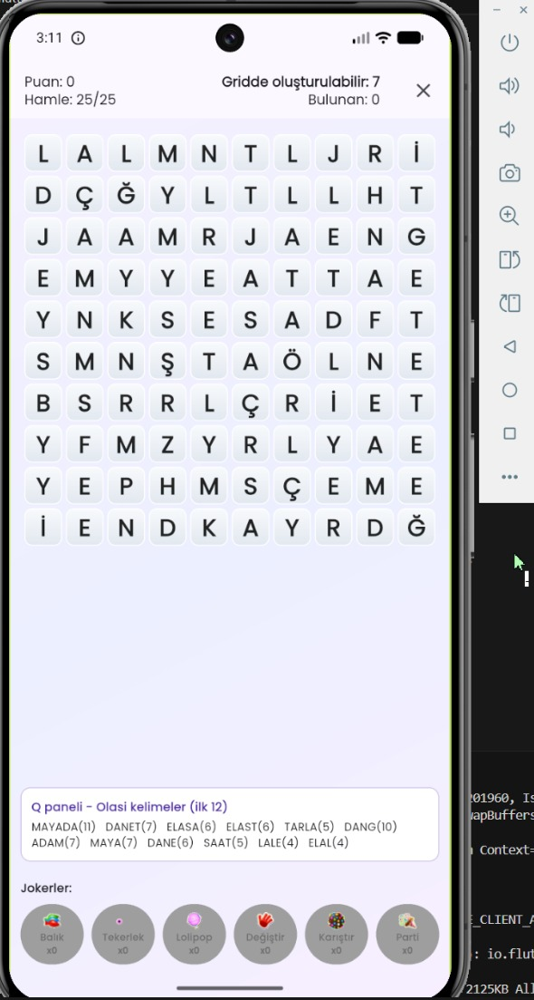
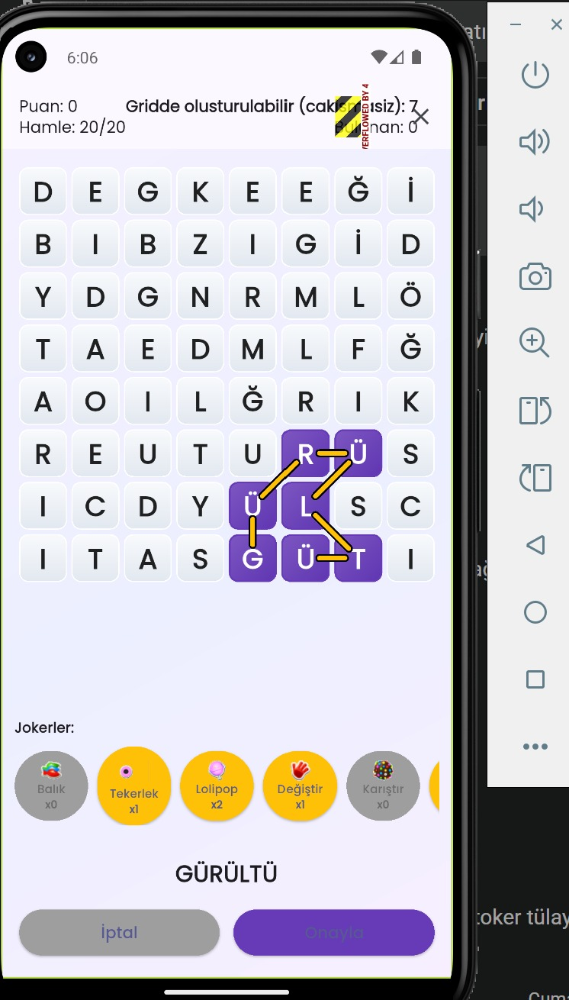
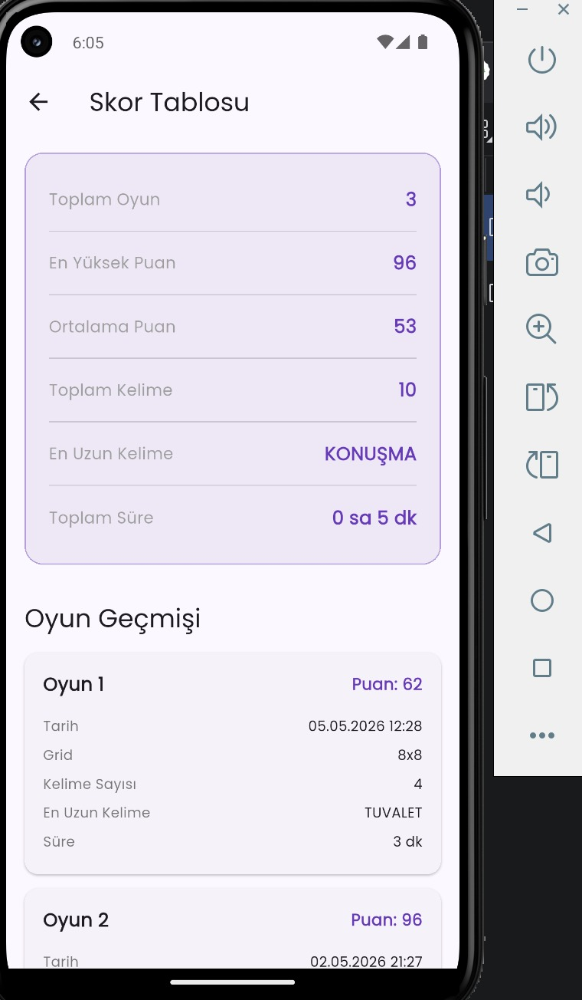
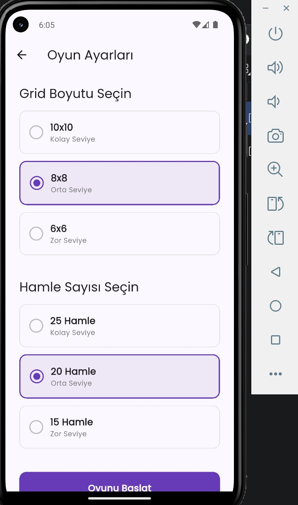
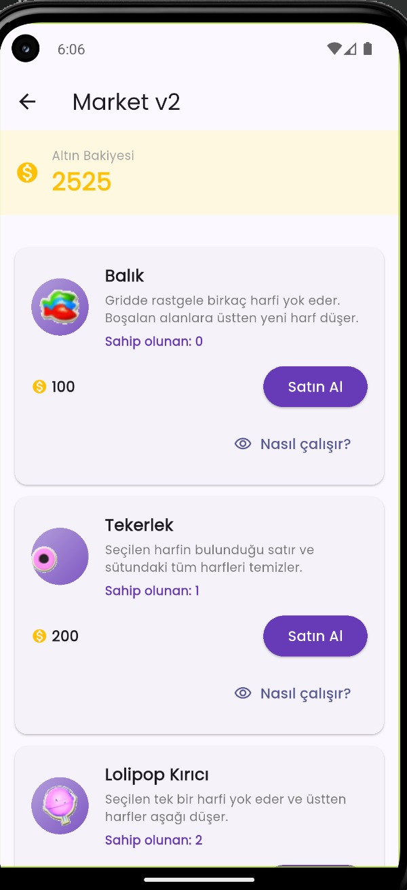

# Kelime Oyunu (Word Game)

NxN harf tablosunda parmakla/sürükleyerek Türkçe kelimeler oluşturduğunuz, joker güçler ve özel yeteneklerle desteklenmiş bir kelime bulmaca oyunu.

## Ekran Görüntüleri (gerçek cihazda çalışırken)

| Oynanış — kelime oluşturma | Oynanış — joker kullanımı |
|---|---|
|  |  |

| Skor Tablosu | Oyun Ayarları |
|---|---|
|  |  |

**Market:**



## Özellikler

- 2600 kelimelik Türkçe sözlük ile geçerlilik kontrolü
- Harf frekansına göre ağırlıklandırılmış puanlama, kombo bonusları
- 6 farklı joker güç: Balık, Çark, Lolipop Kırıcı, Serbest Takas, Karıştırma, Parti Güçlendirici
- Uzun kelimelerle açılan özel güçler: satır/sütun temizleme, alan/mega bomba
- SQLite ile oyuncu, oyun oturumu ve istatistik kaydı
- Android, iOS, Web, Windows, Linux, macOS desteği

## Teknoloji

- Flutter / Dart
- sqflite, shared_preferences, google_fonts, uuid

## Kurulum ve çalıştırma

```bash
flutter pub get
flutter run
```

Windows'ta `run_flutter.bat` ile de çalıştırılabilir.

## Belgeler

- [`PROJE_OZET.md`](PROJE_OZET.md) — mimari, modeller, servisler ve veri akışının detaylı açıklaması
